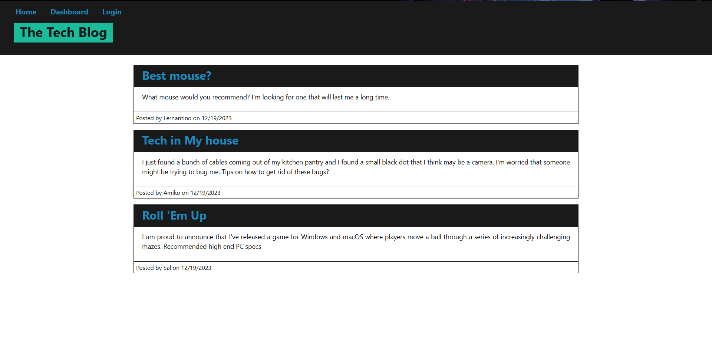
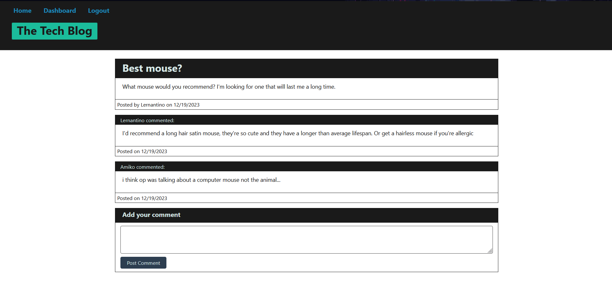

# Tech Blog

## Description
This code is used to create  a CMS-style blog site similar to a Wordpress site, where users can publish their blog posts and comment on other users’ posts as well. Users can create an account and login using their credentials. Data is stored in a datbase using mysql.

## Website Link
https://nataniel-c.github.io/code-quiz

## Website Screenshots

---

---

---

---